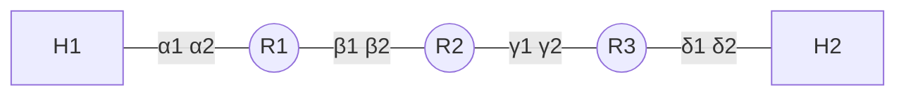
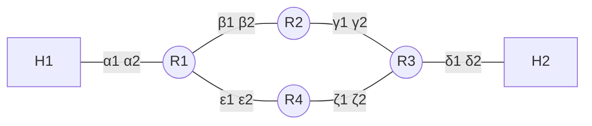
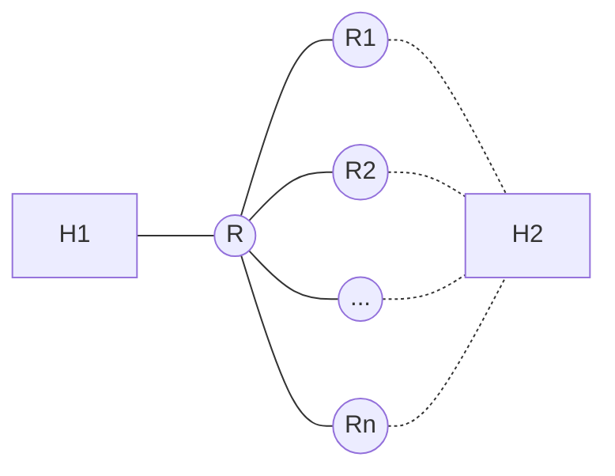
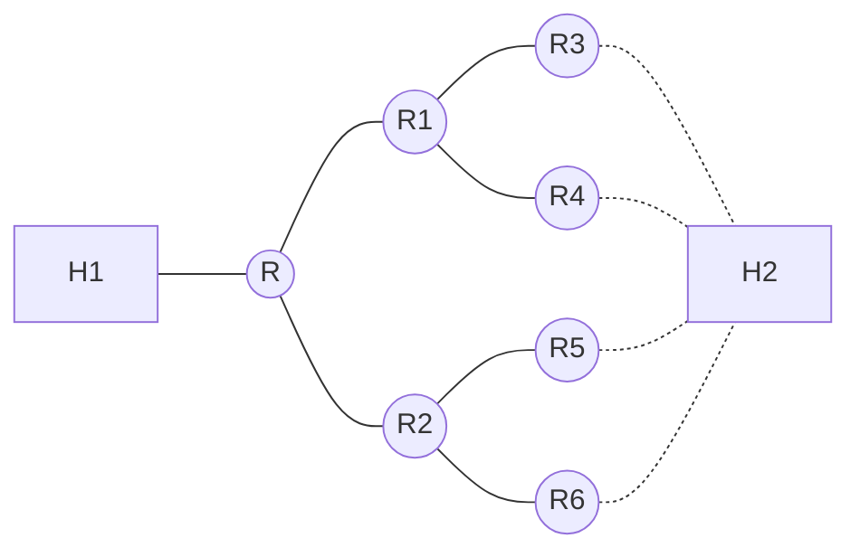
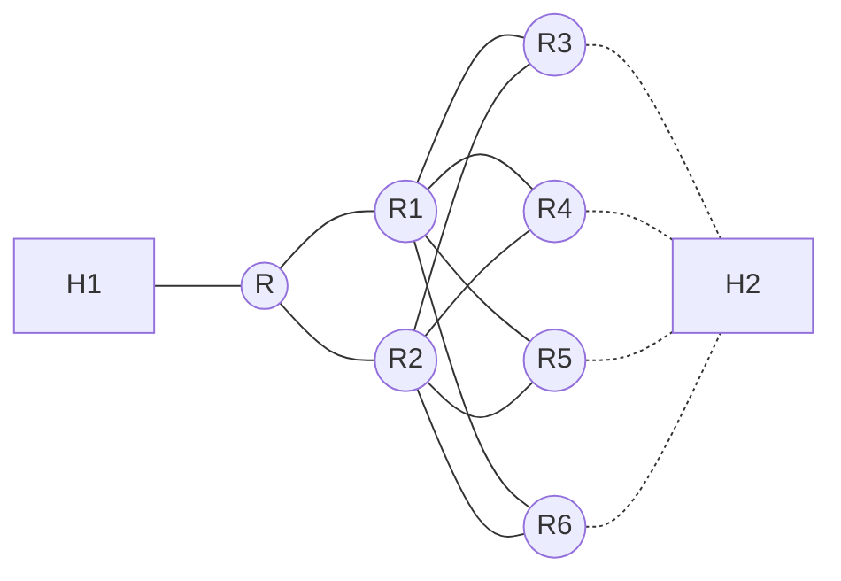
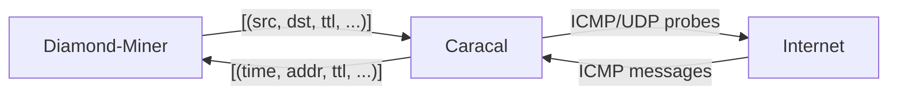

# From `traceroute` to `fast-mda-traceroute`

[`fast-mda-traceroute`](https://github.com/dioptra-io/fast-mda-traceroute)[^naming], hereafter abbreviated as _fmt_, is a multipath traceroute tool that aims to improve on previous tools on two aspects:
1. Speed. Most traceroute tools perform hop-by-hop probing which can become very slow in the presence of high latencies or unresponsive nodes; _fmt_ sends probes in parallel, by taking inspiration from [Yarrp](https://github.com/cmand/yarrp) and [Diamond-Miner](https://github.com/dioptra-io/diamond-miner).
2. Modularity. Most traceroute tools follows a monolithic approach: the packet sending logic is in the same package and written in the same language, usually C, as the traceroute algorithm; _fmt_ is written in Python and only implement the traceroute algorithm, while packet sending is delegated to [caracal](https://github.com/dioptra-io/caracal), a prober written in C++.

Our goal is to provide a traceroute tool which is fast and easy to _hack_ on. That is, it should be easy to try new algorithms, or to debug and fix the existing ones.

Note that we focus on standalone measurements, that is, sporadic measurements to specific destinations on the Internet. As such, we do not seek to match the probing speeds of Yarrp and Diamond-Miner which are designed to scale the whole Internet in a single run, and can send more than 100'000 packets per second. Such speeds are useless when targeting a specific destination as they would overload the network and trigger rate-limiting.

(**note: this document is a draft; feel free to comment :-)**)

## I. Traceroute milestones

We currently omit the following works (**todo: justify**): Mercator[^mercator], DoubleTree[^dtree], Reverse Traceroute[^reverse].

### 1988 - Van Jacobson's traceroute[^traceroute]

The traceroute tool was introduced by Van Jacobson in 1988 on the IETF end2end-interest mailing-list:

> After a frustrating week of trying to figure out "where the !?*! are the packets going?", I cobbled up a program to trace out the route to a host. It works by sending a udp packet with a ttl of one & listening for an icmp "time exceeded" message.  If it gets one, it prints the source address from the icmp message, then bumps the ttl by one & etc.  (As usual, I didn't come up with this clever idea -- I heard Steve Deering mention it at an end-to-end task force meeting.)

Traceroute works by exploiting ICMP Time Exceeded messages (also available in ICMPv6), which are sent by routers when the TTL of a packet reaches zero.
This allows reconstructing the _forward path_ from a source to a destination, that is, the succession of "source-facing" interfaces on the path from the source to the destination.
Consider the following topology, with two hosts (`H*`) and three routers (`R*`):

A traceroute from H1 to H2 would return the following succession of IP addresses: `α2, β2, γ2, δ2`.

Note that traceroute only returns interface addresses, and not router names. The task of associating multiple IP addresses to a single router is called _alias resolution_ and is out of the scope of this document.
Furthermore, traceroute do not give the return path of the packets from the destination to the source. While the return path is usually considered to be symmetric, this is not always the case. Tools such as Reverse Traceroute[^reverse] have been designed to find the reverse path.

The two main issues with traceroute are:
- _stars_, often denoted as _*_, which can be caused by anonymous routers (routers which never send time exceeded messages), routing issues on the return path, or rate limiting (ICMP messages are often handled by the router CPU, instead of ASICs, and as such routers may limit the number of messages they generate per second).
- load-balancing: traceroute may infer false links in the presence of multiple paths from the source to the destination.

### 2006 — Paris Traceroute[^paris]

Consider the following topology:

In order to balance the load, R1 can send packets to R2 or R4.
This load balancing is often carried out on the basis of a flow identifier, containing in particular the IP addresses and source and destination ports.
With a constant flow identifier, we expect to observe one of the following two paths: `α2, β2, γ2, δ2` or `α2, ε2, ζ2, δ2`.
However, the classic traceroute utility does not maintain a constant flow identifier between probes.
We could observe impossible paths: `α2, β2, ζ2, δ2` or `α2, ε2, γ2, δ2`.

The [`paris-traceroute`](https://paris-traceroute.net) CLI tool implements a constant-flow identifier traceroute.

### 2009 — MDA (Multipath Detection Algorithm)[^mda]

Consider the following topology, with a load-balancer `R` with `n` outgoing interfaces towards routers `R1, ..., Rn`:

MDA seeks to answer the following question:
> How many probes with different flow identifiers should be sent in order to guarantee, with some probability, that all the outgoing edges have been detected?

If one were to send 1 flow, it would discover at most 1 of these links; at the opposite, if one were to send an infinite number of flows, it would eventually discover all of these links.
MDA solves this problem under the following assumptions[^mda][^mdalite]:
1. There are no routing changes during the discovery process.
2. There is no per-packet load balancing.
3. Load balancing is uniform-at-random across successor nodes.
4. All probes receive a response.
5. The effect of sending one probe packet has no bearing on the result of any subsequent probe. In particular, load balancers act independently.

The main result of MDA is a formula to compute `n(k,ɛ)`, the number of probes to send to assert with probability `1-ɛ` that a router has no more than `k` outgoing edges[^mdacoupon]: `ceil(ln(ɛ/k) / ln((k-1)/k))`.
As such, 6 different flows are required to assert that there are no more than 1 outgoing edge, 11 flows for 2 edges, and so on.

MDA has been implemented in the [`paris-traceroute`](https://paris-traceroute.net) CLI tool.

### 2010 — Scamper[^scamper]
(**todo**)
Distributed probing tool; implements many algorithms, including Paris Traceroute and MDA.
Client/server driver architecture.

### 2016 — Yarrp[^yarrp]

Classical traceroute tools send probes hop-by-hop: they first send a probe at TTL 1, then wait for a response, and continue to increase the TTL until the destination has been reached. The drawback of this approach is that it can be very slow to attain the destination if some routers do not send ICMP Time Exceeded messages, or if they take a very long time to do so. Furthermore, if the destination never replies, traceroute will keep sending probes until some maximum TTL is reached.

Yarrp seeks to perform Internet-wide traceroutes in less than an hour. To do so, it introduces two main contributions:
- It sends probes in parallel: for a given destination, yarrp will send the probes towards all the TTLs at the same time. Since the TTL of the destination is not known, yarrp will send probes up to some maximum TTL (typically, 32).
- It store its state in the probe packets: classical traceroute tools store some identifier in the probe packet that is later retrieved to match the reply with its probe packet and determine at which TTL and towards which destination the probe was sent. However, if one were to send hundred of thousands of probes in parallel, it would have to store a very large state in order to match replies. Instead, yarrp stores all the probe information in the packet itself, by abusing the IP Identifier field and the ICMP cheksum field. This information is embedded in the ICMP time exceeded messages and decoded by yarrp.

Thanks to these improvements, yarrp can send probes at more than 100'000 packets per second on a classical PC, and perform an Internet-wide traceroute scan in under 15 minutes.
In order to reduce the load on the network, yarrp reuse [masscan](https://github.com/robertdavidgraham/masscan) idea of randomizing the probes. A Generalized Feistel Cipher[^gfc] is used to shuffle the probing space (~4 billion probes for an Internet-wide scan) in constant time and space.

### 2018 — MDA-lite[^mdalite]

MDA gets prohibitively expensive for nested load-balancers.
Consider the following topology:

**(todo: verify the computations)**

To assert with 95% probability that there are R has no more than 2 outgoing edges, MDA requires 11 different flows. However, to assert that R1 has no more than 2 outgoing edges, MDA needs to send more than 11 flows. Indeed, assuming uniform load-balancing, there are 1 out of 2 chances that a flow going through R would go to R1. To solve this, MDA will keep sending different flows towards hop 2 (right after R) until it finds at-least 11 flows that go to R1. Statistically, 2x11=22 flows are required on average to find these. This feature of MDA is called _node control_ in the MDA-Lite paper.

Now, consider the following case of a _meshed diamond_:

In this case, to reach R3, it does not matter if the flow goes through R1 or R2. **(todo)**.

The MDA-lite algorithm detects meshed diamond and reduce the number of probes needed in these cases.
The [MDALite.py](https://github.com/dioptra-io/multilevel-mda-lite) CLI tool implements this algorithm.

### 2020 — Diamond-Miner[^dminer]

Similarly to classical traceroute, the MDA algorithm is sequential, which makes it impractical to conduct Internet-wide survey.

(**todo: explain diamond-miner**)

Diamond-Miner can perform Internet-wide multipath scans in less than a day.
The Diamond-Miner algorithm is implemented in the [`diamond-miner`](https://github.com/dioptra-io/diamond-miner) library.

### 2020 — FlashRoute[^flashroute]

Yarrp sends more probes than a classical traceroute since it does not know at which distance the destination is located.
For example, if the destination is two hops away from the source, and Yarrp is set to probe until TTL 32, it will waste 30 probes.
FlashRoute is a single-path traceroute tool that aims to reduce the number of probes sent by Yarrp by finding the destination TTL, and by using DoubleTree's idea of reducing intra-monitor redundancy.

The [`flashroute`](https://github.com/lambdahuang/FlashRoute) CLI tool implements this algorithm.

## II. The case for separating algorithms from probing

The original version of Diamond-Miner was a monolithic executable written in C++. Most network tools are written in a low-level language such as C or C++ as they often require access to raw network data structures and want to have minimal overhead to run on a large array of systems (or to probe fast in the case of Yarrp and Diamond-Miner).
However, packet sending and receiving is only a small part of a traceroute tool. The big part of the code is the actual logic to compute which probes to send next given the previous replies. We argue that such code should be written in an higher-level language such as Python or Go. Separating algorithms from probing present several advantages:
- Algorithms can rely on a well-tested probing tool, and a probing tool can be substituted for another depending on the situation.
- Algorithms code is easier to understand, debug and maintain.

Diamond-Miner has been split in two components: a Python library, [diamond-miner](https://github.com/dioptra-io/diamond-miner) and a prober written in C++, [caracal](https://github.com/dioptra-io/caracal).

## III. fast-mda-traceroute

Diamond-Miner has been conceived to perform Internet-wide surveys, and process several billions of replies per measurements. As such, it relies on an external database ([ClickHouse](https://clickhouse.com)) and heavily relies on parallel computations. This makes it impractical to use for standalone measurements.
_fmt_ can be seen as a lightweight version of Diamond-Miner, to be used for standalone CLI measurements. It seeks to provide the same output as Scamper's in JSON mode.

### Advantages over Scamper
- Faster: sends probes in parallel
- Always terminate: sometimes Scamper's MDA measurements do not finish (due to flow search?)
- Easier to debug/maintain/improve: small Python codebase

### Disadvantages over Scamper
- New, not as-tested as Scamper
- Sends more probes (**todo: quantify**) due to Diamond-Miner stochastic approach; could be solved by implementing MDA-lite? Hybrid sequential/parallel approach?
- Written in Python with a native extension in C++, potentially harder to distribute than pure self-contained C code. Partially solved with Docker and tools such as [pipx](https://github.com/pypa/pipx/).

### Validation
- Caracal has been used for more than a year for weekly Diamond-Miner measurements, it has sent and received 100B+ IPv4 probes without apparent issues. IPv6 is supported but not as well tested. Caracal has also unit tests for IPv4/IPv6 and ICMP/UDP replies.
- _fmt_ could be tested against [fakeroute](https://github.com/dioptra-io/fakeroute).
- _fmt_ could be tested against Scamper by performing measurements in parallel.

## IV. Tools summary

| Tool                          | Constant flow ID | MDA | Probing    | Architecture  | Language     |
|-------------------------------|------------------|-----|------------|---------------|--------------|
| traceroute[^trimpl]           | N                | N   | Sequential | Monolithic    | C            |
| Paris Traceroute              | Y                | Y   | Sequential | Monolithic    | C            |
| Scamper                       | Y                | Y   | Sequential | Client/Server | C            |
| Yarrp                         | Y                | N   | Parallel   | Monolithic    | C            |
| Multilevel MDA-Lite           | Y                | Y   | Sequential | Monolithic    | Python       |
| FlashRoute                    | Y                | N   | Parallel   | Monolithic    | C++          |
| Caracal / Diamond-Miner       | Y                | Y   | Parallel   | Modular       | C++ / Python & SQL |
| Caracal / fast-mda-traceroute | Y                | Y   | Parallel   | Modular       | C++ / Python |

[^naming]: Naming open to suggestion... :-)
[^trimpl]: There exists multiple implementation of traceroute (BSD, inetutils...) but they all work following the same principle.
[^paris]: Augustin, Brice, et al. "[Avoiding traceroute anomalies with Paris traceroute.](https://dl.acm.org/doi/pdf/10.1145/1177080.1177100)" _Proceedings of the 6th ACM SIGCOMM conference on Internet measurement_. 2006.
[^mda]: Veitch, Darryl, et al. "[Failure control in multipath route tracing.](https://ieeexplore.ieee.org/stamp/stamp.jsp?arnumber=5062055)" _IEEE INFOCOM 2009_. IEEE, 2009.
[^mdacoupon]: Jacquet, Philippe, Mohamed Lamali, and Fabien Mathieu. "[Collecter un nombre inconnu de coupons.](https://hal.inria.fr/hal-01787252/document)" _CORES 2018-Rencontres Francophones sur la Conception de Protocoles, l’Évaluation de Performance et l’Expérimentation des Réseaux de Communication_. 2018.
[^scamper]: Luckie, Matthew. "[Scamper: a scalable and extensible packet prober for active measurement of the internet.](https://dl.acm.org/doi/pdf/10.1145/1879141.1879171?)" _Proceedings of the 10th ACM SIGCOMM conference on Internet measurement_. 2010.
[^yarrp]: Beverly, Robert. "[Yarrp'ing the Internet: Randomized high-speed active topology discovery.](https://dl.acm.org/doi/pdf/10.1145/2987443.2987479)" _Proceedings of the 2016 Internet Measurement Conference_. 2016.
[^mdalite]: Vermeulen, Kevin, et al. "[Multilevel MDA-lite Paris traceroute.](https://dl.acm.org/doi/pdf/10.1145/3278532.3278536)" _Proceedings of the Internet Measurement Conference 2018_. 2018.
[^dminer]: Vermeulen, Kevin, et al. "[Diamond-Miner: Comprehensive Discovery of the Internet's Topology Diamonds.](https://www.usenix.org/system/files/nsdi20-paper-vermeulen.pdf)" _17th USENIX Symposium on Networked Systems Design and Implementation (NSDI 20)_. 2020.
[^flashroute]: Huang, Yuchen, Michael Rabinovich, and Rami Al-Dalky. "[FlashRoute: Efficient Traceroute on a Massive Scale.](https://dl.acm.org/doi/pdf/10.1145/3419394.3423619)" _Proceedings of the ACM Internet Measurement Conference_. 2020.
[^dtree]: Donnet, Benoit, et al. "[Efficient algorithms for large-scale topology discovery.](https://dl.acm.org/doi/pdf/10.1145/1064212.1064256)" _Proceedings of the 2005 ACM SIGMETRICS International conference on Measurement and modeling of computer systems_. 2005.
[^reverse]: Katz-Bassett, Ethan, et al. "[Reverse traceroute.](https://www.usenix.org/legacy/event/nsdi10/tech/full_papers/katz-bassett.pdf)" _NSDI. Vol. 10_. 2010.
[^mercator]: Govindan, Ramesh, and Hongsuda Tangmunarunkit. "[Heuristics for Internet map discovery.](https://ieeexplore.ieee.org/iel5/6725/17999/00832534.pdf)" _Proceedings IEEE INFOCOM 2000. Conference on Computer Communications. Nineteenth Annual Joint Conference of the IEEE Computer and Communications Societies (Cat. No. 00CH37064)_. Vol. 3. IEEE, 2000.
[^traceroute]: The original mailing-list archive seems to not be available anymore on the Internet, but a copy of the message is available here: https://gist.github.com/thiteixeira/50cf5f9c26ca0216e4aa6d42b2440216
[^gfc]: Black, John, and Phillip Rogaway. "[Ciphers with arbitrary finite domains.](https://web.cs.ucdavis.edu/~rogaway/papers/subset.pdf)" _Cryptographers’ track at the RSA conference_. Springer, Berlin, Heidelberg, 2002.
